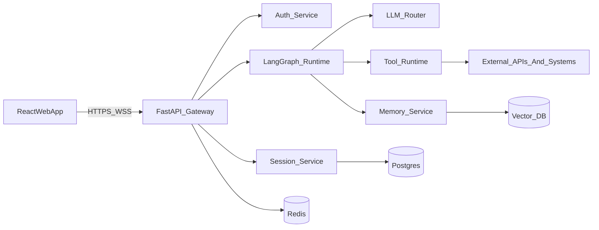

# OpenClaw Python + React 重写方案（核心助手 + Big Bang）

## 目标与边界

- 目标：将当前 TypeScript 主体系统重写为“前后端分离”架构。
- 后端：Python + FastAPI + LangChain/LangGraph。
- 前端：React（Node.js 工程化），仅保留 Web 客户端。
- 不保留：macOS/iOS/Android 客户端形态及其专属运行时。
- 迁移策略：Big Bang（一次性切换），但在切换前通过“影子验证 + 全量回归”降低风险。

## 现状能力基线（必须保留）

从当前仓库抽取的核心能力基线（重写后要对齐）：

- 会话与消息主链路：`chat.send -> auto-reply -> agent-runner`，参考 [src/gateway/server-methods/chat.ts](src/gateway/server-methods/chat.ts)、[src/auto-reply/reply/get-reply-run.ts](src/auto-reply/reply/get-reply-run.ts)、[src/auto-reply/reply/agent-runner-execution.ts](src/auto-reply/reply/agent-runner-execution.ts)。
- 模型选择与回退：参考 [src/agents/model-selection.ts](src/agents/model-selection.ts)、[src/agents/model-fallback.ts](src/agents/model-fallback.ts)。
- 工具编排与策略管道：参考 [src/agents/openclaw-tools.ts](src/agents/openclaw-tools.ts)、[src/agents/tool-policy-pipeline.ts](src/agents/tool-policy-pipeline.ts)。
- 记忆检索：参考 [src/memory/manager.ts](src/memory/manager.ts)、[src/memory/search-manager.ts](src/memory/search-manager.ts)。
- 会话持久化语义：参考 [src/config/sessions/store.ts](src/config/sessions/store.ts)、[src/commands/agent/session-store.ts](src/commands/agent/session-store.ts)。
- Web 传输与事件流语义：参考 [src/gateway/server-http.ts](src/gateway/server-http.ts)、[src/gateway/server/ws-connection.ts](src/gateway/server/ws-connection.ts)、[src/gateway/protocol/index.ts](src/gateway/protocol/index.ts)。

## 目标架构（To-Be）

### 后端分层

- API/Gateway 层（FastAPI）
  - REST：会话管理、历史消息、工具目录、配置查询。
  - WebSocket：流式 token/event、工具调用事件、任务状态事件。
- Orchestration 层（LangGraph）
  - 节点：输入预处理、检索、规划、工具执行、回答整合、后处理。
  - 边：失败重试、模型回退、工具异常分支、人工中断分支。
- Model Router 层（LangChain）
  - 统一模型抽象（OpenAI/Anthropic/Gemini 等），支持策略路由与 fallback。
- Tool Runtime 层
  - 工具注册中心（Schema + 权限 + 超时 + 幂等键）。
  - 调用策略中间件（allowlist/rate-limit/sandbox）。
- Memory 层
  - 短期记忆：会话窗口。
  - 长期记忆：向量库检索（RAG）+ 元数据过滤。
- 数据层
  - Postgres：用户、会话、消息、tool_run、graph_run。
  - Redis：WS 会话状态、限流、任务进度缓存。
  - Vector DB：记忆向量索引（pgvector 或 Qdrant/Weaviate 任一）。

### 前端分层（React）

- App Shell：路由、鉴权、全局布局。
- Data Client：统一 API/WS 客户端（请求 + 事件总线 + 重连策略）。
- Feature 模块：`chat`、`sessions`、`tools`、`settings`。
- 状态管理：推荐 TanStack Query + 轻量全局 store（如 Zustand）。
- 流式渲染：逐 token 更新，支持中断、重试、继续生成。

## 模块重写映射（TS -> Python/React）

- Agent 执行链：
  - [src/auto-reply/reply/get-reply.ts](src/auto-reply/reply/get-reply.ts) / [src/commands/agent.ts](src/commands/agent.ts)
  - 重写为 `backend/app/graph/main_graph.py`（LangGraph 主图 + 子图）。
- 模型策略：
  - [src/agents/model-fallback.ts](src/agents/model-fallback.ts)
  - 重写为 `backend/app/llm/router.py`（provider 策略 + fallback policy）。
- 工具系统：
  - [src/agents/openclaw-tools.ts](src/agents/openclaw-tools.ts)
  - 重写为 `backend/app/tools/registry.py` + `backend/app/tools/middleware.py`。
- 记忆系统：
  - [src/memory/search-manager.ts](src/memory/search-manager.ts)
  - 重写为 `backend/app/memory/retriever.py` + `backend/app/memory/store.py`。
- 会话持久化：
  - [src/config/sessions/store.ts](src/config/sessions/store.ts)
  - 重写为 `backend/app/session/repository.py`（SQLAlchemy + Alembic）。
- 网关协议层：
  - [src/gateway/server-methods.ts](src/gateway/server-methods.ts)
  - 重写为 `backend/app/api/rest/*` + `backend/app/api/ws/*`。
- 前端 UI：
  - 现有 Lit 主体 [ui/src/ui/app.ts](ui/src/ui/app.ts)
  - 重写为 `frontend/src/app/*`（React 路由 + 组件化页面）。

## Big Bang 执行计划（建议 16 周）

### Phase 0（第 1-2 周）契约冻结与设计定版

- 冻结 MVP 功能清单：聊天、会话、工具调用、记忆检索、模型回退。
- 冻结 API 契约：OpenAPI + WS event schema（版本化为 `v1`）。
- 冻结数据模型：ERD + 索引策略 + 审计字段。
- 产出：`architecture_decision_records`、`api-contracts`、`migration-checklist`。

### Phase 1（第 3-6 周）后端骨架与核心链路

- FastAPI 工程搭建：配置、日志、鉴权、依赖注入、错误码规范。
- LangGraph 主流程跑通：输入 -> 检索 -> 生成 -> 输出。
- LLM Router + fallback 策略接入（至少 2 个 provider）。
- Postgres + Alembic 初始化，打通 session/message 基础 CRUD。

### Phase 2（第 7-10 周）工具、记忆、流式事件

- 工具注册中心 + 执行中间件（超时、重试、权限）。
- 记忆层接入向量库，支持写入、召回、会话关联。
- WS 流式协议完成：token、tool_start/tool_end、run_status、abort。
- 引入可观测性：结构化日志、指标、链路追踪（OpenTelemetry）。

### Phase 3（第 8-12 周，与 Phase 2 并行）React 前端重写

- React App Shell + 登录鉴权 + 会话列表。
- Chat 页面：流式消息、工具事件时间线、中断/重试。
- Settings 页面：模型配置、工具开关、记忆策略配置。
- 与后端 `v1` 契约联调，完成端到端 happy path。

### Phase 4（第 13-15 周）全量验证与切换预演

- 回归测试：单元、集成、E2E、并发压测、故障注入。
- 影子流量（只读/镜像）验证：对比旧系统与新系统输出质量与稳定性。
- 数据迁移演练：历史会话导入 + 索引回建 + 校验脚本。
- 发布演练：一键部署、回滚演练、监控告警演练。

### Phase 5（第 16 周）Big Bang 切换

- 冻结旧系统写入窗口（短维护窗）。
- 执行最终迁移脚本并校验。
- DNS/网关切流到新后端与新前端。
- 切换后 24-72 小时战情值守，按 SLO 监控与快速修复。

## 数据迁移方案

- 源数据识别：旧会话/消息存储语义来自 [src/config/sessions/store.ts](src/config/sessions/store.ts)。
- 迁移策略：
  - 全量迁移历史会话（T-1 快照）。
  - 切换窗口增量迁移（binlog/事件补偿或二次导入）。
  - 完成后执行一致性校验（会话数、消息数、抽样内容 hash）。
- 输出物：`migrate_sessions.py`、`validate_migration.py`、迁移报告。

## 测试与质量门禁

- 单元测试：LangGraph 节点、工具中间件、路由策略。
- 集成测试：API + DB + VectorDB + Redis 联测。
- E2E 测试：Web 端用户主流程（新会话、连续追问、工具调用、终止生成）。
- 回归基准：建立 100-300 条 golden prompts，比对回答质量与工具调用正确性。
- 性能目标（建议）：
  - P95 首 token < 2.5s
  - P95 完整响应 < 12s（中等复杂问题）
  - WS 断线自动恢复成功率 > 99%

## 安全与运维

- 鉴权：JWT + Refresh Token，服务端校验 scope。
- 秘钥管理：环境变量 + Secret Manager（禁止落盘明文）。
- 限流与防滥用：IP + user + route 三维限流。
- 审计：工具调用审计日志（谁、何时、参数摘要、结果摘要）。
- 监控：错误率、时延、token 消耗、工具失败率、检索命中率。

## 风险清单与缓解

- 风险：Big Bang 天然切换风险高。
  - 缓解：强制执行影子验证 + 预发布演练 + 可回滚脚本。
- 风险：旧系统会话语义迁移偏差。
  - 缓解：先定义“语义映射文档”，迁移前后双向抽样校验。
- 风险：工具调用安全边界变化。
  - 缓解：默认 deny 策略，按白名单逐步放开。
- 风险：前端流式交互体验退化。
  - 缓解：建立前端性能预算与 WebSocket chaos 测试。

## 交付物清单

- 后端仓库（Python）：FastAPI + LangGraph + LangChain + Alembic + tests。
- 前端仓库（React）：Vite/Next.js 二选一（推荐 Vite + React Router）。
- 契约资产：OpenAPI、WS event schema、SDK types。
- 运维资产：Docker Compose/K8s manifests、监控仪表盘、告警规则、Runbook。
- 迁移资产：迁移脚本、校验脚本、切换与回滚手册。

## 完成定义（DoD）

- 核心助手能力与当前基线对齐：聊天、会话、工具、记忆、fallback 全部可用。
- Web 前端覆盖核心用户流程，旧多端入口已下线。
- 通过质量门禁并完成切换演练，具备可验证回滚路径。
